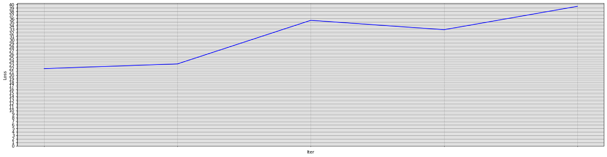

# Reflection on Overall Experience

I enjoyed the group project, as it presented new technical skills I had to learn such as designing machine learning models. The project was an interesting exercise in making software for a specific client, and only having limited freedom in terms of functionality.

Furthermore, while the group aspect was challenging at first with different members often having fundamentally different and incompatible ideas, it was useful to practice resolving such disagreements swiftly. Indeed, our group grew more cohesive over the course of the project.

# Summary of Personal Contribution

I worked primarily on the *Text Empathiser* component of the framework. Broadly, this component takes some pre-defined sentence (e.g., configured by Clinicians, or coming from an external mecical API) and makes it more empathetic.

The bulk of my research has been on text style transfer. In particular, *Formal* &rarr; *Casual*. This is done in the hope that a great amount of perceived empathy/humanity can be injected into the pre-defined text by converting it from formal speech to casual speech.

The code can be found [here](https://github.com/Group-Charlie-2022/Empathizer.git).

Additionally, I've created some basic front-end interfaces for the chatbot, to demonstrate that our API is easily deployed to many platforms.

The code for these can be found here:
 - [Web interface](https://github.com/Group-Charlie-2022/WebClient)
 - [Discord bot](https://github.com/Group-Charlie-2022/DiscordBot)

## Front ends

It is important that our chatbot be portable, in the sense that it can be deployed via a wide variety of front-ends (WhatsApp, Viber, etc.). While WhatsApp bots usually cost money to deploy and we did not have a budget for this project, I made a web interface and a discord-bot interface to demonstrate the principle that our project is platform-independent.

### Web Interface

### Discord Bot

## *Formal* &rarr; *Casual* Style Transfer

### Styleformer

I found a Python library called [Styleformer](https://github.com/PrithivirajDamodaran/Styleformer) which performs *Formal* &rarr; *Casual* style transfer. However, it was a bit too slow for real-time conversation (about 3-4s per sentence).

### Dataset

While waiting to gain access to the [GYAFC corpus](https://github.com/raosudha89/GYAFC-corpus) (which I never did), I used Styleformer which, though too slow to create real-time transformations, was a handy tool for labelling training data. I've used an unlabelled dataset of [sentences in the introduction paragraphs of Wikipedia articles](https://www.kaggle.com/mikeortman/wikipedia-sentences) and used Styleformer to translate each from casual to formal English, saving the results as a placeholder labelled dataset.

### Attempt 1 &mdash; PyTorch Sequence-to-Sequence Model with Attention

Following guidance from [the PyTorch website](https://pytorch.org/tutorials/intermediate/seq2seq_translation_tutorial.html) I implemented a basic style transfer model which used GRUs for recurrance and an *Attention* layer.

This model was quite basic and overfit terribly. This was likely due, in part, to the fact that I was using the same dataset for training as for validation.

In addition, this model used one-hot vectors to encode each word. Since support for a large vocabulary will likely be required for this project, the model had too many parameters to train and my GPU did not have enough memory for this model to be trained effectively, even over a long training period.

Limiting the vocabulary size resulted in no useful training. In fact, the loss *increased*.

### Attempt 2 &mdash; Keras Sequence-to-Sequence Model

I created the second model in Keras as it abstracts away a lot of the boilerplate code. I felt that this would make the models easier to debug and extend, as it is much more clear what every component is doing.

This model is based primarily on the following resources

- https://blog.keras.io/a-ten-minute-introduction-to-sequence-to-sequence-learning-in-keras.html
- https://github.com/lukas/ml-class/blob/master/videos/seq2seq/train.py
- https://github.com/lukas/ml-class/blob/master/videos/cnn-text/imdb-embedding.py

Initially this model used a one-hot character vector for each character in the input/output sequences. This was much more manageable memory-wise as the list of usable characters is much smaller than the list of usable words.

However, by working on the character level, this model took far too long to train. I estimate that it would require at least several weeks of non-stop computation time to train the model to a point at which it would be usable in a chatbot.

Furthermore, more semantic meaning is gained from working on the word-level. Rather than train my own word-embedding layer I opted to use [GloVe](https://nlp.stanford.edu/projects/glove/), a pre-trained embedding layer.

However, I had significant problems training the model. Neither the training loss nor validation loss was decreasing significantly even after several hours of training.

In my opinion this could be one of several factors:

- LSTMs simply take much longer to train than GRUs, and over a much longer timespan then progress would have been made. This would nonetheless make the model unusable due to the timespan of the project.

- The dataset contained mostly words which did not appear in the GloVe embedding. This is significant possibility, as Wikipedia tends to contain quite technical language and uncommon words. Though the Wikipedia dataset was only a placeholder, even the final chatbot needed to use similarly rare medical jargon.

- The model did not have enough parameters (i.e., the hidden dimension of the RNNs was too small) to properly learn the natural language patterns required to perform formality transfer. This would be a serious issue because the model's size was already pushing the limits of what my GPU could handle.

Though this model showed some promise, these serious issues were fundamental enough to justify starting over using a different technique.

### Attempt 3 &mdash; Transformer Sequence-to-Sequence model

This model was based primarily on the following resources:

- https://arxiv.org/abs/1706.03762
- https://keras.io/examples/nlp/neural_machine_translation_with_transformer/
- https://www.youtube.com/watch?v=TQQlZhbC5ps

This model used transformers rather than RNNs, and made use of the *Attention* mechanism implemented in my first model.

Instead of using GloVe, this model included a trainable positional embedding layer. More research is required into how the efficacy of this model changes when instead using GloVe. My hypothesis, however, was that a trainable embedding will allow the model to be more flexible with respect to uncommon words such as medical jargon.

Unfortunately, this model did still show signs of overfitting. The training loss was decreasing at a good rate, but the validation loss was staying steadily high.

I would have liked to have done more research but I would guess this is due to some combination of the following factors:

- The network was too big. The network may have had enough parameters that it simply memorised the training data.

- The dataset was too small. There may not have been enough training data to sufficiently demonstrate the natural language patterns for the model to learn.

- The dataset was poor quality. Though the Styleformer library used to label the data performed well, training another model on its output may have been akin to taking a photocopy of a photocopy.

- The training sentences were too long. With the Wikipedia current dataset, some sentences were up to 600 words long. This is more than the chatbot should output in any given sentence, and this high sequence length might have been affecting the learning.

### Attempt 4 &mdash; Redesigning Styleformer

The final model I ended up using was based on Styleformer, but with all of the unnecessary featured stripped out. This, coupled with making the model better able to run on the GPU, made the empathiser fast enough to hold real-time conversations (approx. 1ms per conversion).

## Contributions Made by Other Team Members

In my opinion, all of the other team members worked very well and contributed exactly what was required in a timely manner.

Klaudia provided the conversational component which worked well. Even in a case where the question categoriser miscategorises an unsafe/medical question as a conversational one, the conversational bot generates a good, empathetic respone.

Alex and Bethany created the question categoriser. They worked well together and divided the work sensibly, with Bethany generating the training data and Alex building the model which learns from it. When issues arose they were quick to identify and resolve them.

Ben created the medical component. While he seemed unsure about how to initially get started on the system, he was very willing to ask for guidance and once we had all discussed an approach together, he implemented it himself and his results worked very well. Though the medical component can occasionally offer some questionable advice, this is largely a limitation of the information available on the WHO website &mdash; which our client said that we should use &mdash; rather than of the implementation.

Overall I am very happy with every team member's work and contributions.

## Sample code

As written above, the code for my contributions can be found in the following repositories:

 - [Empathizer](https://github.com/Group-Charlie-2022/Empathizer.git)
 - [Web interface](https://github.com/Group-Charlie-2022/WebClient)
 - [Discord bot](https://github.com/Group-Charlie-2022/DiscordBot)
