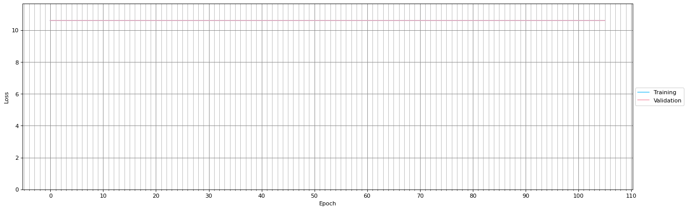

# Individual Progress Report - Morgan Saville

## Overview

I have been working primarily on the *Text Empathiser* component of the framework. Broadly, this component will take some pre-defined sentence (e.g., configured by Clinicians, or coming from an external mecical API) and makes it more empathetic.

The bulk of my research has been on text style transfer. In particular, *Formal* &rarr; *Casual*. This is done in the hope that a great amount of perceived empathy/humanity can be injected into the pre-defined text by converting it from formal speech to casual speech.

The code can be found [here](https://github.com/Group-Charlie-2022/Empathizer.git).

Additionally, I've been creating some basic front-end interfaces for the chatbot, to demonstrate that our API is easily deployed to many platforms.

The code for these can be found here:
 - [Web interface](https://github.com/Group-Charlie-2022/WebClient)
 - [Discord bot](https://github.com/Group-Charlie-2022/DiscordBot)

## Tl;dr

### Where am I at?
- Created web and discord-bot front-ends for the chatbot
- Currently using a Transformer-based model to translate formal sentences into casual sentences.
- Promising results but requiring further research and better training data.

### What still needs to be done?
- Procuring better training data
- Tweaking the Transformer model
- Adding proper punctuation to output sentences.
- Experimenting with phatic expressions (e.g., "I'm sorry to hear that!") and emoticons
    - This will require some sentiment analysis
- Ensure safety
    - Prove that the model is sufficiently unlikely to dangerously alter the meaning
- Integrate with the rest of the project

## 14/02/2022

### Front ends

It is important that our chatbot be portable, in the sense that it can be deployed via a wide variety of front-ends (WhatsApp, Viber, etc.). While WhatsApp bots usually cost money to deploy and we do not have a budget for this project, I've made a web interface and a discord-bot interface to demonstrate the principle that our project is platform-independent.

**NOTE:** At this point, the API is not sending back any meaningful response. However, this is simply placeholder functionality. The point being demonstrated is that both interfaces are using the same API (as could many other interfaces), which will eventually be a functioning chatbot.

#### Web Interface

#### Discord Bot

### *Formal* &rarr; *Casual* Style Transfer

#### Styleformer

I found a Python library called [Styleformer](https://github.com/PrithivirajDamodaran/Styleformer) which performs *Formal* &rarr; *Casual* style transfer. However, it is a bit too slow for real-time conversation (about 3-4s per sentence).

#### Dataset

I hope to gain access to the [GYAFC corpus](https://github.com/raosudha89/GYAFC-corpus) which is a benchmark dataset for formality style transfer. I have reached out to the creator, Joel Tetreault, but have not yet heard back.

If I do not hear back soon I will use an alternative dataset such as those found in the [Data4StylizedS2S repository](https://github.com/MarkWuNLP/Data4StylizedS2S).

In the mean-time, I've been using Styleformer which, though too slow to create real-time transformations, is a handy tool for labelling training data. I've used an unlabelled dataset of [sentences in the introduction paragraphs of Wikipedia articles](https://www.kaggle.com/mikeortman/wikipedia-sentences) and used Styleformer to translate each from casual to formal English, saving the results as a placeholder labelled dataset.

This dataset does require the assumption that Wikipedia articles are written in formal English, but I believe this is justified. Furthermore, this dataset is just to be used as a placeholder to test the algorithms.

#### Attempt 1 &mdash; PyTorch Sequence-to-Sequence Model with Attention

Following guidance from [the PyTorch website](https://pytorch.org/tutorials/intermediate/seq2seq_translation_tutorial.html) I implemented a basic style transfer model which used GRUs for recurrance and an *Attention* layer.

This model was quite basic and overfit terribly. This was likely due, in part, to the fact that I was using the same dataset for training as for validation.

In addition, this model used one-hot vectors to encode each word. Since support for a large vocabulary will likely be required for this project, the model had too many parameters to train and my GPU did not have enough memory for this model to be trained effectively, even over a long training period.

Limiting the vocabulary size resulted in no useful training. In fact, the loss *increased*.

#### Attempt 2 &mdash; Keras Sequence-to-Sequence Model

I created the second model in Keras as it abstracts away a lot of the boilerplate code. I felt that this would make the models easier to debug and extend, as it is much more clear what every component is doing.

This model is based primarily on the following resources

- https://blog.keras.io/a-ten-minute-introduction-to-sequence-to-sequence-learning-in-keras.html
- https://github.com/lukas/ml-class/blob/master/videos/seq2seq/train.py
- https://github.com/lukas/ml-class/blob/master/videos/cnn-text/imdb-embedding.py

Initially this model used a one-hot character vector for each character in the input/output sequences. This was much more manageable memory-wise as the list of usable characters is much smaller than the list of usable words.

However, by working on the character level, this model took far too long to train. I estimate that it would require at least several weeks of non-stop computation time to train the model to a point at which it would be usable in a chatbot.

Furthermore, more semantic meaning is gained from working on the word-level. Rather than train my own word-embedding layer I opted to use [GloVe](https://nlp.stanford.edu/projects/glove/), a pre-trained embedding layer.

However, I had significant problems training the model. Neither the training loss nor validation loss was decreasing significantly even after several hours of training.

In my opinion this could be one of several factors:

- LSTMs simply take much longer to train than GRUs, and over a much longer timespan then progress would have been made. This would nonetheless make the model unusable due to the timespan of the project.

- The dataset contained mostly words which did not appear in the GloVe embedding. This is significant possibility, as Wikipedia tends to contain quite technical language and uncommon words. Though the Wikipedia dataset is only a placeholder, it is still not unlikely that our final dataset will contain similarly rare medical jargon.

- The model did not have enough parameters (i.e., the hidden dimension of the RNNs was too small) to properly learn the natural language patterns required to perform formality transfer. This would be a serious issue because the model's size was already pushing the limits of what my GPU could handle.

Though this model showed some promise, these serious issues are fundamental enough to justify starting over using a different technique.

#### Attempt 3 &mdash; Transformer Sequence-to-Sequence model

This, so far is the most promising model.

It is based primarily on the following resources:

- https://arxiv.org/abs/1706.03762
- https://keras.io/examples/nlp/neural_machine_translation_with_transformer/
- https://www.youtube.com/watch?v=TQQlZhbC5ps

This model uses transformers rather than RNNs, and makes use of the *Attention* mechanism implemented in my first model.

Instead of using GloVe, this model includes a trainable positional embedding layer. More research is required into how the efficacy of this model changes when instead using GloVe. My hypothesis, however, is that a trainable embedding will allow the model to be more flexible with respect to uncommon words such as medical jargon.

Unfortunately, this model does still show signs of overfitting. The training loss is decreasing at a good rate, but the validation loss is staying steadily high.

This requires more research but I would guess this is due to some combination of the following factors:

- The network is too big. The network may have enough parameters that it simply memorises the training data.

- The dataset is too small. There may not be enough training data to sufficiently demonstrate the natural language patterns for the model to learn.

- The dataset is poor quality. Though the Styleformer library used to label the data performs relatively well, training another model on its output may be akin to taking a photocopy of a photocopy.

- The training sentences are too long. With the current dataset, some sentences are up to 600 words long. This is likely more than the chatbot should output in any given sentence, and this high sequence length might be affecting the learning.

All of these problems will hopefully be solved once I am able to procure a better dataset, or in the meantime by cleaning up the placeholder one.

One side effect of this model is that the output sentences lack punctuation and capitalisation. This will need to be re-introduced in a later step.